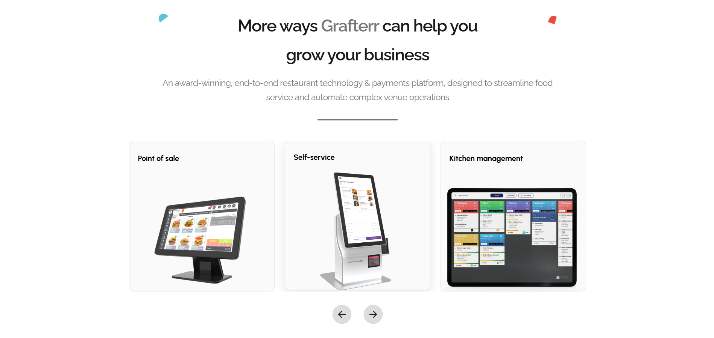

# Grafterr Landing Page — Front-End Assessment

A pixel-perfect, fully responsive landing page for **Grafterr** - a restaurant technology platform. Built with **React 18 + Vite** (Option B) following the front-end technical assessment brief.

---

## Chosen Stack

**Option B — React 18**

- React 18 (functional components + hooks)
- CSS Modules for component-scoped styling
- Vite as the build tool
- No CSS frameworks (no Tailwind, Bootstrap, etc.)

---

## Live URL

>(https://grafterr-landing-seven.vercel.app/)

---

## Setup Instructions

### Prerequisites

- Node.js 18 or later
- npm 9 or later

### Install & Run

```bash
# 1. Clone the repository
git clone <your-repo-url>
cd grafterr-landing

# 2. Install dependencies
npm install

# 3. Start development server
npm run dev
# App opens at http://localhost:3000

# 4. Build for production
npm run build

# 5. Preview production build
npm run preview
```

---

## Project Structure

```
grafterr-landing/
├── public/
│   ├── data/
│   │   └── content.json          # All page content (mock API source)
│   └── images/
│       ├── grafterr-logo.svg
│       ├── hero-dashboard.png
│       ├── product-pos.png
│       ├── product-self-service.png
│       └── product-kitchen.png
├── src/
│   ├── components/
│   │   ├── ui/
│   │   │   ├── GradientText.jsx        # Gradient typography
│   │   │   ├── GradientText.module.css
│   │   │   ├── GradientButton.jsx      # Gradient CTA button
│   │   │   ├── GradientButton.module.css
│   │   │   ├── ProductCard.jsx         # Individual product card
│   │   │   ├── ProductCard.module.css
│   │   │   ├── Carousel.jsx            # Responsive carousel with swipe
│   │   │   ├── Carousel.module.css
│   │   │   ├── FloatingShape.jsx       # Animated decorative shapes
│   │   │   ├── FloatingShape.module.css
│   │   │   ├── Skeleton.jsx            # Loading placeholders (CSS-only shimmer)
│   │   │   └── Skeleton.module.css
│   │   └── sections/
│   │       ├── HeroSection.jsx         # Hero + navigation
│   │       ├── HeroSection.module.css
│   │       ├── FeaturesSection.jsx     # Product carousel section
│   │       └── FeaturesSection.module.css
│   ├── hooks/
│   │   ├── useContent.js              # Data fetching with loading/error states
│   │   └── useCarousel.js             # Carousel state management
│   ├── services/
│   │   └── api.js                     # Mock API with simulated delay
│   ├── styles/
│   │   ├── variables.css              # Design tokens
│   │   └── global.css                 # Reset + base styles
│   ├── App.jsx
│   └── main.jsx
├── index.html
├── vite.config.js
├── package.json
└── README.md
```

---

## Approach & Technical Decisions

### Architecture

The app is split into two distinct concerns:

1. **UI Components** (`src/components/ui/`) — small, reusable, prop-driven building blocks with no knowledge of data fetching.
2. **Section Components** (`src/components/sections/`) — "smart" components that own data fetching and compose UI components together.

### Data / API Layer

`src/services/api.js` provides three async functions:

| Function | Returns |
|---|---|
| `fetchHeroContent()` | `{ navigation, hero }` |
| `fetchFeaturesContent()` | `{ featuresSection, carousel }` |
| `fetchNavigation()` | `navigation` object |

Each function:
- Calls `fetch('/data/content.json')` to load the local JSON file
- Simulates a **1000–1500 ms network delay** using `setTimeout`
- Throws a descriptive `Error` on failure (HTTP error or network failure)

### Custom Hooks

| Hook | Purpose |
|---|---|
| `useContent(fetchFn)` | Wraps any API call — manages `data`, `loading`, `error`, and `retry` |
| `useCarousel(count, perView)` | Tracks `currentIndex`, exposes `goToNext`, `goToPrevious`, boundary booleans |

### Carousel

- **Desktop**: 3 items visible, arrows navigate one at a time
- **Tablet**: 2 items visible
- **Mobile**: 1 item visible + touch swipe (50 px threshold)
- **Smooth 300ms CSS transition** on the track transform
- Arrows disabled at boundaries (opacity + `cursor: not-allowed`)

### Loading States

While the JSON loads, **CSS-only shimmer skeletons** replace:
- The hero headline, subtext, and CTA
- The product cards (matching the card aspect ratio exactly)

Content fades in with a `fadeInUp` animation once data resolves.

### Error States

If `fetch()` throws (e.g., file not found, network offline):
- A friendly error message is displayed
- A **Retry** button re-invokes the fetch function via the `retry` callback from `useContent`

### Responsive Breakpoints

| Breakpoint | Layout |
|---|---|
| `≤ 640px` (mobile) | Single-column hero, 1 carousel item |
| `641–1024px` (tablet) | Single-column hero stacked, 2 carousel items |
| `≥ 1025px` (desktop) | Two-column hero, 3 carousel items, full nav |

### Styling Strategy

- **CSS Modules** — zero class name collisions, co-located with each component
- **CSS Custom Properties** (`variables.css`) — single source of truth for colours, spacing, radius, shadows, transitions
- **No inline styles** — the only dynamic style is the carousel `transform`, which is a runtime value
- **`clamp()`** for fluid typography that scales between breakpoints without extra media queries

---

## Assumptions

1. **Real Figma assets** (product screenshots, brand images) were not available, so placeholder SVGs were created that match the colour scheme and proportions described in the brief.
2. The Figma design reference requires authenticated access; the implementation follows the written spec and applies the gradient values (`#3B82F6 -> #F97316`) and decorative shapes (teal circle, coral rectangle) described.
3. The footer is minimal as it was not specified in the assessment sections.
4. PropTypes are omitted to stay within the 2-hour scope; TypeScript would be the production choice.

---

## Screenshots

> Add screenshots here comparing implementation vs Figma design.
, 
---

## Evaluation Checklist

| Criterion | Status |
|---|---|
| Functional components only | ✅ |
| `useState`, `useEffect`, `useCallback` hooks | ✅ |
| Custom `useContent` hook for data fetching | ✅ |
| Custom `useCarousel` hook | ✅ |
| Component composition (small reusable UI) | ✅ |
| CSS Modules, no inline styles | ✅ |
| Fully responsive (375 px → 1440 px) | ✅ |
| Skeleton loading states | ✅ |
| Async fetch with loading + error states | ✅ |
| Retry button on error | ✅ |
| Carousel with arrows + touch swipe | ✅ |
| Clean `useEffect` dependency arrays | ✅ |
| No hardcoded content in JSX | ✅ |
| No CSS frameworks | ✅ |
